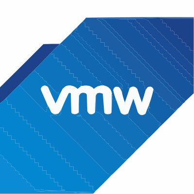
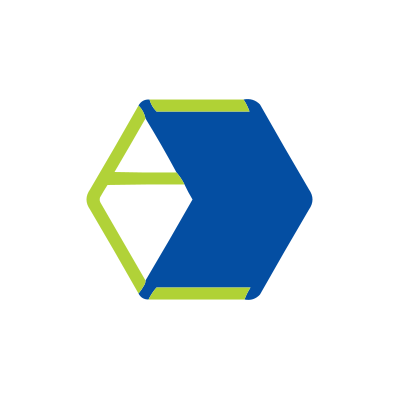
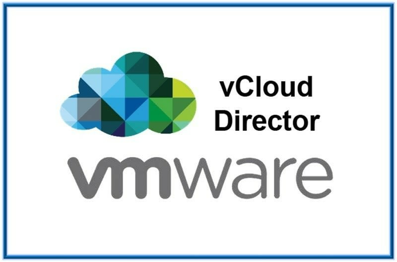
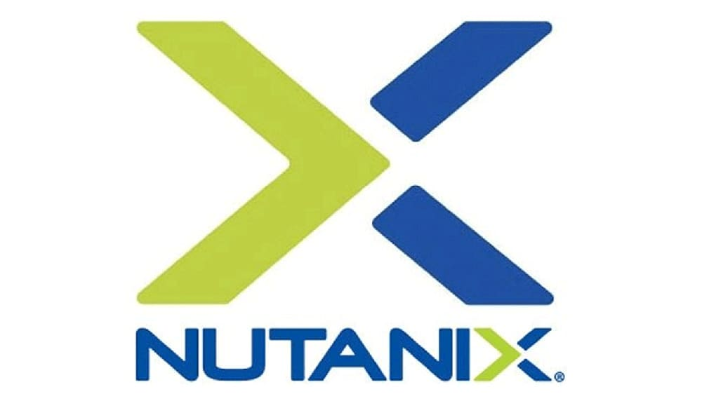
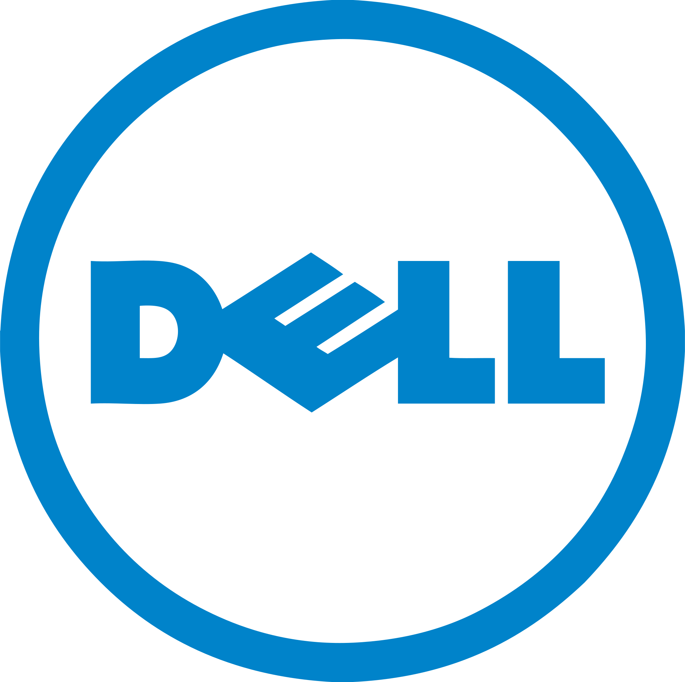

<h2> Hi there 👋 I'm Sunay! </h2>

  
  
  
  

---

### 👨‍💻 About Me
Senior Software Developer with **8+ years of experience** specializing in Virtualization, Cloud Infrastructure, Data Protection, and Disaster Recovery. I enjoy designing scalable enterprise solutions and resolving complex distributed system challenges.

Currently working as a **Member of Technical Staff (MTS-3)** at **Cohesity**, building robust backup and restore solutions for File Systems and Cloud workloads.

---

### 🚀 Personal Projects

  
  
  
  

---

### 🛠️ Tech Stack & Skills

**Languages & Frameworks:**

      

**Cloud & Virtualization:**

        

**Storage Arrays:**

     

---

### 💼 Work Experience

- **Cohesity** (Oct 2023 - Present)
  *Member of Technical Staff (MTS-3)*
  - Developing and maintaining core functionalities for File System Backup, Restore, and Disaster Recovery (NFS, SMB, S3).
  - Designed and developed Azure Blob Container Backup/Restore and AWS S3 Cross-Region copy Restore on the multi-tenant Helios cloud platform.

- **Commvault** (Jul 2017 - Jul 2023)
  *Senior Engineer II*
  - Engineered virtual machine Backup, Restore, and Disaster Recovery workflows.
  - Led cross-functional projects including load-balanced restores, vCloud Director Unix Proxy Support, and Nutanix VMCentric snapshot engines.
  - Successfully resolved over 200 customer escalations with custom debugging tools.

- **Philips Innovation Labs** (Jul 2016 - Jun 2017)
  *Automation Developer Intern*
  - Automated manual test cases of PACS clients and contributed to an in-house Automation framework.

---

### 🎓 Education

- **M.Tech. Computer Science** - BMS College of Engineering (CGPA: 8.28)
