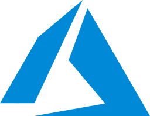

<h2> Hi there 👋 I'm Sunay! </h2>

&nbsp;
&nbsp;

---

### 👨‍💻 About Me
Senior Software Developer with **8+ years of experience** specializing in Virtualization, Cloud Infrastructure, Data Protection, and Disaster Recovery. I enjoy designing scalable enterprise solutions and resolving complex distributed system challenges.

Currently working as a **Member of Technical Staff (MTS-3)** at **Cohesity**, building robust backup and restore solutions for File Systems and Cloud workloads.

---

### 🚀 Personal Projects

&nbsp;&nbsp;&nbsp;
&nbsp;&nbsp;&nbsp;
&nbsp;&nbsp;&nbsp;

---

### 🛠️ Tech Stack & Skills

#### Languages & Frameworks

&nbsp;&nbsp;
&nbsp;&nbsp;
&nbsp;&nbsp;
&nbsp;&nbsp;

#### Cloud & Virtualization

&nbsp;&nbsp;
&nbsp;&nbsp;
&nbsp;&nbsp;
&nbsp;&nbsp;
&nbsp;&nbsp;
&nbsp;&nbsp;

#### Storage Arrays

&nbsp;&nbsp;
&nbsp;&nbsp;
&nbsp;&nbsp;

---

### 💼 Work Experience

- **Cohesity** (Oct 2023 - Present)
  *Member of Technical Staff (MTS-3)*
  - **Full-Stack Development:** Currently architecting and implementing features across the stack using **Angular** for the frontend and **C++** for distributed backend systems.
  - **Cloud & Core Infrastructure:** Developing core functionalities for File System Backup/Restore (NFS, SMB, S3). Designed and developed Azure Blob Container Backup and AWS S3 Cross-Region copy Restore on the multi-tenant Helios cloud platform.
  - **Reliability & Escalations:** Successfully investigated and resolved **~160 critical customer issues**, delivering direct code fixes, patches, and advanced configuration optimizations to ensure enterprise stability.

- **Commvault** (Jul 2017 - Jul 2023)
  *Senior Engineer II*
  - **System Engineering:** Engineered robust virtual machine Backup, Restore, and Disaster Recovery workflows for enterprise-scale environments.
  - **Feature Leadership:** Led cross-functional projects including load-balanced restores, vCloud Director Unix Proxy Support, and Nutanix VMCentric snapshot engines.
  - **Customer Success:** Successfully resolved **200+ complex customer escalations**, building custom debugging tools and delivering critical code patches to stabilize production deployments.

- **Philips Innovation Labs** (Jul 2016 - Jun 2017)
  *Automation Developer Intern*
  - Automated manual test cases of PACS clients and contributed to an in-house Automation framework.

---

### 🎓 Education

- **M.Tech. Computer Science** - BMS College of Engineering (CGPA: 8.28)
